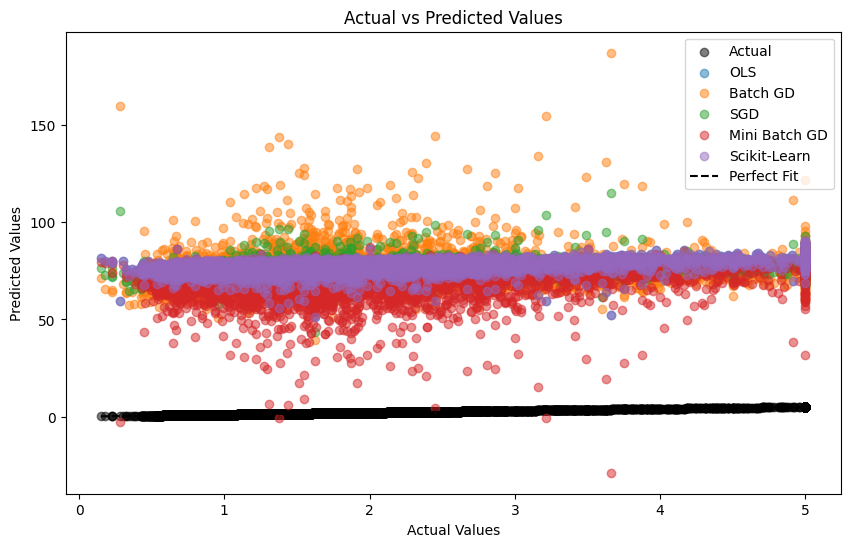
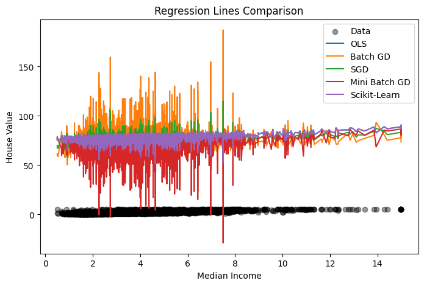
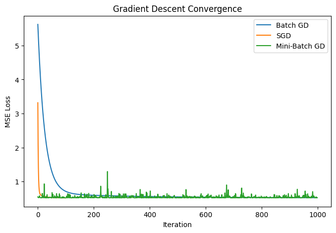
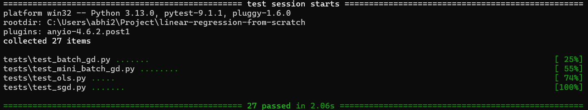

# Linear Regression From Scratch

A complete implementation of Linear Regression built from scratch using **NumPy**.

This project focuses on understanding the mathematical foundations behind Linear Regression by implementing different optimization techniques without using machine learning libraries for model training.

The custom implementations are compared with **Scikit-Learn Linear Regression** to validate correctness and performance.

---

# Project Overview

Linear Regression is a supervised learning algorithm used to predict continuous target values.

The model learns the relationship between input features and target values:

$\hat{y}=Xw+b$

where:

- $\hat{y}$ : Predicted target value
- $X$ : Input feature matrix
- $w$ : Model weights (coefficients)
- $b$ : Bias/intercept term

The objective is to minimize the Mean Squared Error:

$MSE=\frac{1}{n}\sum_{i=1}^{n}(y_i-\hat{y_i})^2$

---

# Features Implemented

## Regression Algorithms

- Ordinary Least Squares (OLS)
- Batch Gradient Descent
- Stochastic Gradient Descent (SGD)
- Mini-Batch Gradient Descent

## Additional Components

- Custom Base Regression class
- Custom evaluation metrics
- Exception handling
- Model validation
- Unit testing using PyTest
- Comparison with Scikit-Learn
- Training convergence visualization

---

# Repository Structure

```
linear-regression-from-scratch/

│
├── linear_regression/
│   │
│   ├── base.py
│   ├── metrics.py
│   ├── exceptions.py
│   ├── ols.py
│   ├── batch_gd.py
│   ├── stochastic_gd.py
│   └── mini_batch_gd.py
│
├── tests/
│   │
│   ├── test_ols.py
│   ├── test_batch_gd.py
│   ├── test_sgd.py
│   └── test_mini_batch_gd.py
│
├── examples/
│
├── notebooks/
│
├── images/
│   ├── actual_vs_predicted.png
│   ├── regression_lines.png
│   └── convergence.png
│
├── requirements.txt
└── README.md
```

---

# Installation

Clone the repository:

```bash
git clone https://github.com/saklaniabhimanyu/linear-regression-from-scratch.git
```

Navigate into the project:

```bash
cd linear-regression-from-scratch
```

Install dependencies:

```bash
pip install -r requirements.txt
```

---

# Implemented Models

## 1. Ordinary Least Squares (OLS)

OLS solves Linear Regression using the closed-form Normal Equation.

$w=(X^TX)^+X^Ty$

The pseudo-inverse is used instead of direct matrix inversion to handle singular matrices.

### Advantages

- Exact mathematical solution
- No learning rate required
- Fast for small and medium datasets

### Limitations

- Expensive for large datasets
- Requires matrix operations

---

## 2. Batch Gradient Descent

Batch Gradient Descent calculates gradients using the complete training dataset for every update.

Gradient calculation:

$dw=-\frac{2}{n}X^T(y-\hat{y})$

$db=-\frac{2}{n}\sum(y-\hat{y})$

Parameter update:

$w=w-\alpha dw$

$b=b-\alpha db$

### Advantages

- Stable convergence
- Works well with large datasets
- Simple optimization approach

### Limitations

- Requires learning rate tuning
- Slower for very large datasets

---

## 3. Stochastic Gradient Descent (SGD)

SGD updates model parameters using one training sample at a time.

Instead of calculating gradients from the entire dataset, it performs frequent updates.

### Advantages

- Faster updates
- Suitable for large datasets
- Can escape local minima due to noisy updates

### Limitations

- Higher variance updates
- Loss can fluctuate during training
- Requires careful learning rate selection

---

## 4. Mini-Batch Gradient Descent

Mini-Batch Gradient Descent updates parameters using a small group of samples.

It combines advantages of Batch GD and SGD.

### Advantages

- Faster than Batch GD
- More stable than SGD
- Efficient for large datasets

### Limitations

- Requires batch size selection
- Requires hyperparameter tuning

---

# Evaluation Metrics

The models are evaluated using:

## Mean Absolute Error (MAE)

Measures the average absolute difference between actual and predicted values.

Lower values indicate better performance.

---

## Mean Squared Error (MSE)

Measures the average squared difference between actual and predicted values.

Large errors are penalized more heavily.

Lower values indicate better performance.

---

## Root Mean Squared Error (RMSE)

RMSE is the square root of MSE.

It converts the error back to the original target scale.

Lower values indicate better performance.

---

## Mean Absolute Percentage Error (MAPE)

Measures prediction error as a percentage.

Lower values indicate better performance.

---

## R² Score

Measures how much variance in the target variable is explained by the model.

Higher values indicate better performance.

---

# Dataset

The models are evaluated using the:

**California Housing Dataset**

Dataset details:

- Samples: 20,640
- Features: 8
- Target: Median House Value

Features include:

- Median Income
- House Age
- Average Rooms
- Average Bedrooms
- Population
- Average Occupancy
- Latitude
- Longitude

Feature scaling is applied before training Gradient Descent based models.

---

# Model Comparison

Custom implementations are compared against Scikit-Learn Linear Regression.

| Model | R² Score |
|---|---:|
| OLS | 0.591051 |
| Batch GD | 0.591272 |
| SGD | 0.591258 |
| Mini-Batch GD | 0.580453 |
| Scikit-Learn | 0.591051 |

---

# Results

The custom implementations achieve performance very close to Scikit-Learn.

Observations:

- OLS and Scikit-Learn produce identical results because both solve Linear Regression using least squares optimization.
- Batch GD and SGD achieve comparable performance after proper feature scaling and learning rate selection.
- Mini-Batch GD performs slightly lower due to gradient approximation using smaller batches.
- Gradient Descent models require tuning of:
  - Learning rate
  - Number of iterations
  - Batch size

---

# Visualizations

## Actual vs Predicted Values

This plot compares predictions from different models against actual target values.



---

## Regression Line Comparison

Shows the predicted relationship between Median Income and House Value.



---

## Gradient Descent Convergence

Shows how Mean Squared Error decreases during training.



---

# Testing

The project uses PyTest for automated testing.

Run tests:

```bash
pytest
```

Current tests cover:

- Model initialization
- Invalid parameter handling
- Model fitting
- Prediction
- Evaluation metrics
- Gradient Descent behaviour

Example output:

```
27 passed
```
Sample :


---

# Example Usage

```python
from linear_regression.ols import LinearRegressionOLS

model = LinearRegressionOLS()

model.fit(X_train, y_train)

predictions = model.predict(X_test)

score = model.score(X_test, y_test)
```

---

# Future Improvements

Possible extensions:

- Ridge Regression
- Lasso Regression
- Polynomial Regression
- Regularization support
- Learning rate schedulers
- Additional datasets
- More optimization algorithms

---

# Technologies Used

- Python
- NumPy
- Pandas
- Matplotlib
- Scikit-Learn (comparison only)
- PyTest

---

# Author

**Abhimanyu Saklani**

GitHub:
https://github.com/saklaniabhimanyu
