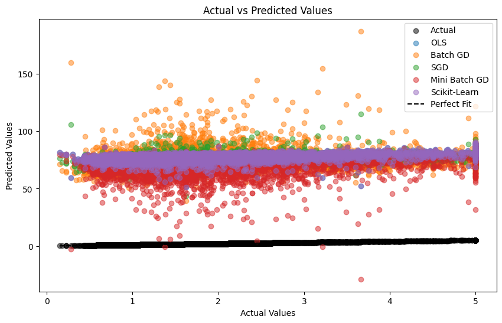
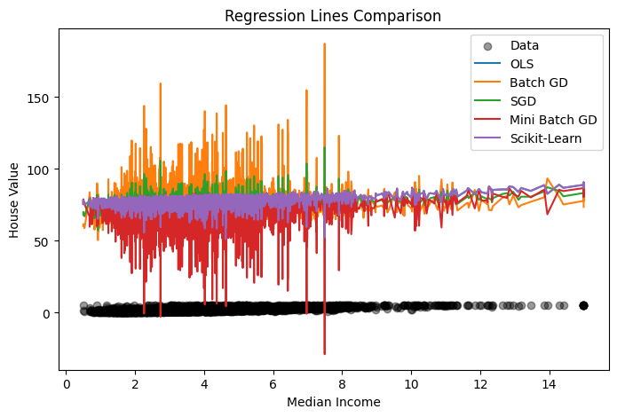
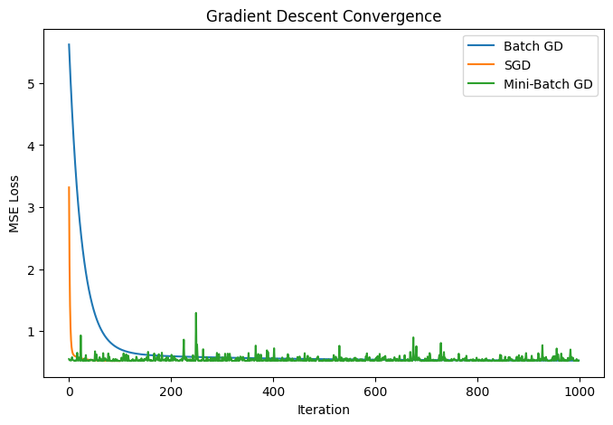
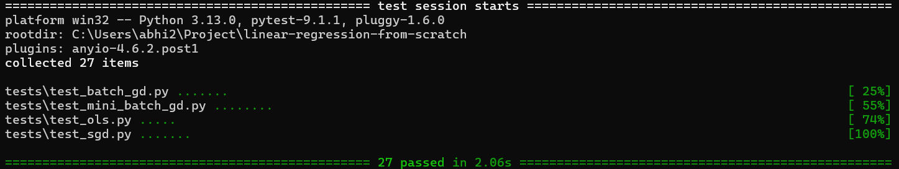

# Linear Regression From Scratch
A complete implementation of Linear Regression algorithms built entirely from scratch using **NumPy**.

The goal of this project is to understand how linear models actually work under the hood by implementing their mathematical foundations instead of relying on machine learning libraries for training. 

Every algorithm is written from scratch, while **Scikit-Learn** is used only to verify the correctness of the implementations and compare performance.
________________________________________
# Project Overview

Linear Regression is one of the most fundamental supervised learning algorithms for predicting continuous values. 

Instead of treating it as a black box, this project focuses on implementing the complete learning process—from solving the normal equation to optimizing parameters using different gradient descent techniques.

As the project evolved, support for regularized regression (Ridge and Lasso) and Polynomial Regression was added to explore techniques that improve model generalization and capture non-linear relationships.

#### The prediction function is:
$\hat{y}=Xw+b$

where:

- $\hat{y}$ : Predicted target value
- $X$ : Input feature matrix
- $w$ : Model weights (coefficients)
- $b$ : Bias/intercept term

The objective is to minimize the Mean Squared Error:

$MSE=\frac{1}{n}\sum_{i=1}^{n}(y_i-\hat{y_i})^2$
________________________________________
# Features

## Regression Models
-	Ordinary Least Squares (OLS)
-	Batch Gradient Descent
-	Stochastic Gradient Descent (SGD)
-	Mini-Batch Gradient Descent
-	Ridge Regression (L2 Regularization)
-	Lasso Regression (L1 Regularization)
-	Polynomial Regression

## Additional Components
-	Shared Base Regression class
-	Custom evaluation metrics
-	Polynomial feature generation
-	Exception handling and input validation
-	Automated unit tests using PyTest
-	Model comparison with Scikit-Learn
-	Gradient descent convergence visualization
________________________________________
# Repository Structure

```
linear-regression-from-scratch/

│
├── linear_regression/
│   │
│   |── __init__.py
│   ├── base.py
│   ├── batch_gd.py
│   ├── exceptions.py
│   ├── lasso.py
│   ├── metrics.py
│   ├── mini_batch_gd.py
│   ├── ols.py
│   ├── polynomial_features.py
│   ├── polynomial_regression.py
│   ├── ridge.py
│   └── stochastic_gd.py
|
├── tests/
│   │
│   ├── test_batch_gd.py
│   ├── test_lasso.py
│   ├── test_mini_batch_gd.py
│   ├── test_ols.py
│   ├── test_polynomial_features.py
│   ├── test_polynomial_regression.py
│   ├── test_ridge.py
│   └── test_sgd.py
│
├── examples/
│
├── notebooks/
│
├── images/
│   ├── actual_vs_predicted.png
│   ├── regression_lines.png
│   └── convergence.png
│
├── requirements.txt
└── README.md
```

________________________________________
# Installation

Clone the repository:

```bash
git clone https://github.com/saklaniabhimanyu/linear-regression-from-scratch.git
```

Navigate into the project:

```bash
cd linear-regression-from-scratch
```

Install dependencies:

```bash
pip install -r requirements.txt
```

________________________________________
# Implemented Models

## 1. Ordinary Least Squares (OLS)

Computes the exact solution using the Normal Equation.

$w=(X^TX)^+X^Ty$

A pseudo-inverse is used instead of direct matrix inversion, making the implementation more robust when dealing with singular matrices.

Pros
-	Exact solution
-	No learning rate required
- Fast for smaller datasets
Cons
- Computationally expensive for very large datasets
________________________________________
## 2.1 Batch Gradient Descent

Updates the model using the entire training dataset during every iteration.

It provides smooth and stable convergence but may become slower as dataset size increases.
Gradient calculation:

$dw=-\frac{2}{n}X^T(y-\hat{y})$

$db=-\frac{2}{n}\sum(y-\hat{y})$

Parameter update:

$w=w-\alpha dw$

$b=b-\alpha db$

________________________________________
## 2.2 Stochastic Gradient Descent (SGD)

Updates model parameters after processing each individual training sample.

Because updates happen frequently, SGD trains much faster on large datasets, although the 

optimization path is noisier.
________________________________________
### 2.3 Mini-Batch Gradient Descent

Uses small batches of training samples instead of the complete dataset.

It strikes a balance between Batch Gradient Descent and SGD, making it the optimization method most commonly used in deep learning.
________________________________________
## 3. Ridge Regression

Ridge Regression extends Linear Regression by adding an L2 regularization penalty.

$Loss = MSE + w^2$

The penalty discourages excessively large coefficients, helping reduce overfitting while keeping all features in the model.
________________________________________
# 4. Lasso Regression

Lasso Regression applies L1 regularization.

$Loss = MSE + |w|$

Unlike Ridge, Lasso can shrink some coefficients all the way to zero, effectively performing feature selection.
________________________________________
## 5. Polynomial Regression

Polynomial Regression models non-linear relationships by expanding the original input features into polynomial terms.

For example, instead of fitting:

$y=w_1x+b$

it can learn relationships such as:

$y=w_2x^2+w_1x+b$

The project includes a custom Polynomial Feature Generator implemented from scratch.
________________________________________
## Evaluation Metrics

Each model is evaluated using multiple regression metrics:

-	Mean Absolute Error (MAE)
-	Mean Squared Error (MSE)
-	Root Mean Squared Error (RMSE)
-	Mean Absolute Percentage Error (MAPE)
-	R² Score

These metrics provide a balanced view of prediction accuracy and model performance.
________________________________________
# Dataset

The models are evaluated using the:

**California Housing Dataset**

Dataset details:

- Samples: 20,640
- Features: 8
- Target: Median House Value

Features include:

- Median Income
- House Age
- Average Rooms
- Average Bedrooms
- Population
- Average Occupancy
- Latitude
- Longitude

Feature scaling is applied before training Gradient Descent based models.

---

# Model Comparison

Custom implementations are compared against Scikit-Learn Linear Regression.

| Model | R² Score |
|---|---:|
| OLS | 0.591051 |
| Batch GD | 0.591272 |
| SGD | 0.591258 |
| Mini-Batch GD | 0.580453 |
| Lasso | 0.002681 |
| Ridge |0.591075 |
| Scikit-Learn | 0.591051 |


---

# Results
- OLS matches Scikit-Learn almost exactly, as both solve the least-squares optimization problem.
- Batch Gradient Descent and Stochastic Gradient Descent converge to nearly the same solution after appropriate feature scaling and hyperparameter tuning.
- Mini-Batch Gradient Descent achieves competitive performance while offering faster parameter updates than full Batch Gradient Descent.
- Ridge Regression produces results very close to OLS, showing that L2 regularization preserves predictive performance while reducing the impact of large coefficients.
- Lasso Regression performs significantly worse on this dataset with the chosen regularization strength, indicating that the penalty shrinks many coefficients toward zero and leads to underfitting.
- The close agreement between the custom implementations and Scikit-Learn validates the correctness of the algorithms implemented from scratch.

________________________________________

# Visualizations

The repository includes several visualizations to better understand model behavior:

## Actual vs Predicted Values

This plot compares predictions from different models against actual target values.



---

## Regression Line Comparison

Shows the predicted relationship between Median Income and House Value.



---

## Gradient Descent Convergence

Shows how Mean Squared Error decreases during training.



---

# Testing

The project includes comprehensive unit tests using PyTest.

Tests cover:

- Model initialization
- Invalid parameter handling
- Model fitting
- Prediction
- Evaluation metrics
- Polynomial feature generation
- Gradient Descent optimization
- Regularization methods (Ridge and Lasso)
- Model scoring (R² Score)
- Feature scaling compatibility
- Numerical stability and edge cases
- Consistency with Scikit-Learn implementations


Run all tests with:
Example output:

```
49 passed
```
Sample :


_____________________________
# Example Usage

```python
from linear_regression.ols import LinearRegressionOLS

model = LinearRegressionOLS()

model.fit(X_train, y_train)

predictions = model.predict(X_test)

score = model.score(X_test, y_test)
```
________________________________________
# Future Improvements

Some ideas for extending the project further:
- Learning rate schedulers
-	Early stopping
________________________________________
# Technologies Used
-	Python
-	NumPy
-	Pandas
-	Matplotlib
-	Scikit-Learn (for comparison only)
-	PyTest
________________________________________
# Author

Abhimanyu Saklani

If you found this project helpful, feel free to ⭐ the repository or share your feedback.

GitHub: https://github.com/saklaniabhimanyu
